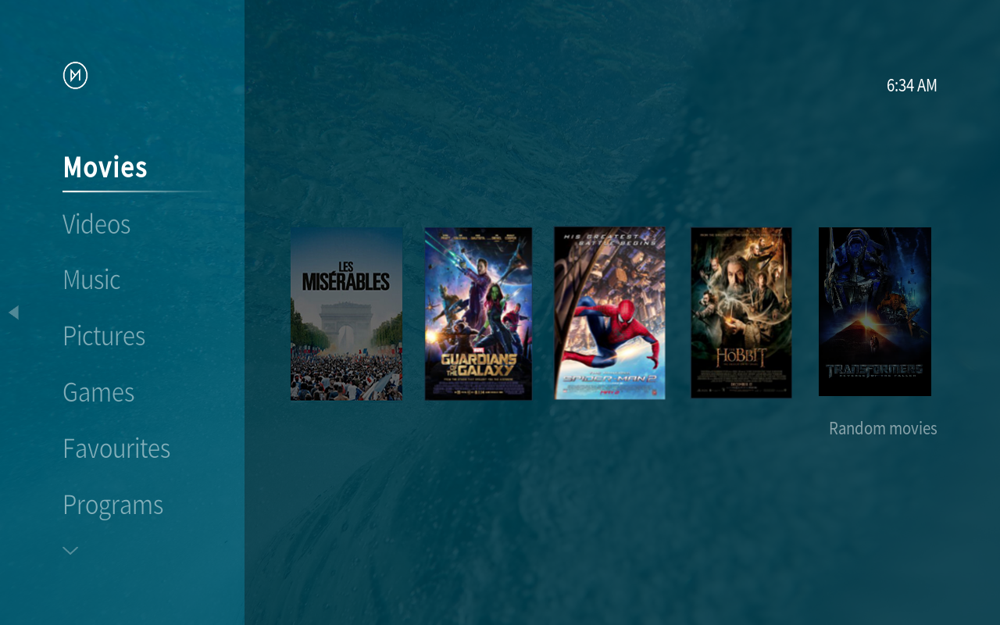
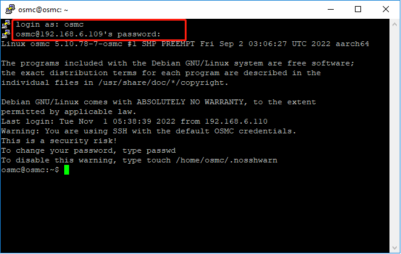

.. _kodi_osmc:

Install Kodi on Raspberry Pi Use OSMC
======================================

|link_kodi| is one of the most popular ways to play media on your Raspberry Pi. It supports a large number of different media formats, and you can use this media center software to play music, videos, and even show your images. 

With Kodi, you can scan and sort all your media files. It will download information about your files and present it to you in an attractive manner.

You can install Kodi directly on your Raspberry Pi system, or you can just use a distribution with Kodi pre-installed, such as |link_osmc| and |link_libreelec|.

In this tutorial, we will show you how to install and set up OSMC Media Center.

OSMC is an operating system distribution that uses Kodi media center software.

One of the advantages of OSMC is that it is actively maintained and built on top of a full operating system, allowing it to be easily extended beyond its built-in Kodi functionality. 
For example, we can easily set up Netflix on it because we can easily access the backend.

For the best experience with Kodi, we recommend that you use the Raspberry Pi 4 or newer. The stronger processor and increased RAM will help Kodi run at its best.

Components List
-----------------------

**Required**

* Pironman
* Micro SD card (8GB+)
* Ethernet cable or Wi-Fi
* HDMI cable
* Monitor
* Keyboard and mouse

**Optional**

* M.2 SATA SSD

Install the OSMC Image
---------------------------------

You will learn how to install OSMC image on a Micro SD card in this section. Traditionally, burning tools used to be Etcher and Win32 disk imager, but Raspberry Pi has now developed Raspberry Pi Imager, which is an all-in-one image and tool that makes image installation easy.

#. If you don't have |link_imager|, please download it.

#. Open Raspberry Pi Imager, and click **CHOOSE OS**.

    .. image:: img/kodi/kodi1.png

#. Click the **Media player OS** button. This button will bring up 2 images for Kodi.

    .. image:: img/kodi/kodi2.png

#. Here we choose **OSMC**.

    .. image:: img/kodi/kodi6.png

#. Raspberry Pi 0/1, 2/3, 4/400 versions are provided; please select the appropriate version.

    .. image:: img/kodi/kodi7.png

#. After selecting the appropriate drive, then click Write.

    .. image:: img/kodi/kodi8.png

#. Once the installation success message appears, you can pull out the Micro SD.

    .. image:: img/kodi/kodi9.png

Initial Setup of OSMC on the Raspberry Pi
-------------------------------------------------

Now that we have installed OSMC to an SD card, we will walk you through the process of its initial set up process.

#. Now pull out the Micro SD card and insert it into the card slot of the Piron.

    .. image:: img/kodi/connect_power.jpg

#. Connect your display to the Pironman with the HDMI cable, then turn it on with the power switch.

#. You will be greeted with the following screen when you launch OSMC for the first time. Please wait until the setup process is complete before continuing with our OSMC setup guide.

    .. image:: img/kodi/kodi10.png

#. Once the installation is complete, you will need to reboot Pironman. You can reboot by long pressing the power switch or by re-plugging the power cable.

#. The configuration page will appear once you have rebooted, and it will ask you to select the language. Select **Yes** to continue the setup after selecting a language for OSMC.

    .. image:: img/kodi/kodi11.png

#. Next, you will be asked to select the time zone. Make sure to select the relevant time zone where you live, as this will help ensure that the time is correct.

    .. image:: img/kodi/kodi12.png

#. You will be asked if you would like to rename your device here. Default device name is **osmc** and it is recommended to change to another name.

    .. image:: img/kodi/kodi13.png

#. You can disable or enable the SSH service in this section. OSMC's setup tool will enable SSH by default. Click **Accept** to continue the installation.

    .. image:: img/kodi/kodi14.png

#. In this step, you will be asked to agree to OSMC's and Kodi's terms of service. Please select the **Continue** option after reading the license and agreeing to it.

    .. image:: img/kodi/kodi15.png

#. Select a theme of your choice. For this guide, we will use the default **OSMC** theme.

    .. image:: img/kodi/kodi19.png

#. Now you will be asked if you want to sign up for OSMC's newsletter. For this guide, we will continue using the **No thanks** option.

    .. image:: img/kodi/kodi20.png

#. At this point, you have now finally completed the initial configuration process of OSMC on your Raspberry Pi. You can take yourself to the Kodi main screen by selecting the **Exit** option.

    .. image:: img/kodi/kodi21.png

Configuring Network in OSMC
--------------------------------------------

In this section, we will show you how to configure the network for your device using the OSMC interface.

#. Go to the **Settings** option.

    .. image:: img/kodi/kodi22.png

#. Then go to the **My OSMC** menu.

    .. image:: img/kodi/kodi16.png

#. Select **Network**. This menu also contains several other options that can help you configure OSMC on your Raspberry Pi.

    .. image:: img/kodi/kodi17.png

#. You can configure WIFI in this option, or just plug in a network cable, after which you will see information about the connection and remember this IP address, which you will need to access OSMC remotely later in the guide.

    .. image:: img/kodi/kodi24.png

Files Transfer
-----------------

Sometimes you may need to transfer files between your OSMC device and your computer in order to edit, add, or change files that already exist.
Depending on your previous experience, there are many ways to transfer files. Some of these methods work right out of the box (if SSH is enabled). Some methods require additional OSMC features, such as a Samba (SMB) server or an FTP server.

**SFTP**

For the sake of simplicity, we will focus only on SFTP using FileZilla, since it works out of the box on all three platforms (Windows, macOS, and Linux) with no additional changes to OSMC (required the SSH has been enabled).

When you open FileZilla for the first time, you will not connect to anything, you will need to provide the host, username and password.

* Host: sftp://ip-address-of-your-osmc
* User name: osmc
* Password: osmc (or the password specified by your user)
* Port: can be left blank to use the default SSH port 22

Once you have entered these, simply click the Quick Connect button to establish a connection.

    .. image:: img/kodi/kodi37.png

**Samba Server**

You can also transfer files using SMB server, which is a more intuitive and useful way. But you need to go to OSMC and install this server first, as follows.

#. Go to the **My OSMC** menu page and select the **App Store** icon.

    .. image:: img/kodi/kodi28.png

#. Select **Samba (SMB) Server**.

    .. image:: img/kodi/kodi29.png

#. Select **Install**.

    .. image:: img/kodi/kodi30.png

#. Select **Apply** to start the SMB server installation.

    .. image:: img/kodi/kodi31.png

#. A popup will appear in the upper right corner  to prompt you to install. Once the installation is complete, you will be able to access your Raspberry Pi files from your own computer.

    .. image:: img/kodi/kodi32.png

#. On Windows, use ``Win+R`` to open Run Box.

    .. image:: img/kodi/kodi33.png

#. Type ``\\ip address`` in the input box.

    .. image:: img/kodi/kodi34.png

#. Now you will see a shared drive called ``osmc``.

    .. image:: img/kodi/kodi35.png

#. Once you click in, you will see different folders and now you can transfer your music, videos or movies to them.

    .. image:: img/kodi/kodi36.png

Adding OSMC's videos to Scrape
-----------------------------------

In this section, we will show you how to add a video folder for OSMC to scrape.

Scrapping video is a fairly simple process and is one of the main features of Kodi.

#. First, we need to go to the **Video** menu.

    .. image:: img/kodi/kodi45.png

#. Next, we need to select the **Files** submenu. This submenu will allow you to browse through the imported folders or add additional folders.

    .. image:: img/kodi/kodi38.png

#. Next, select the **Add video..** option. In this option, we will add folders for OSMC’s Kodi to scan into its library.

    .. image:: img/kodi/kodi39.png

#. In this menu, you need to select the **Browse** or **Add** option.

    .. image:: img/kodi/kodi40.png

    * The **Browse** option will allow you to find folders via OSMC's file browser.
    * **Add** option will allow you to manually input the path to the directory.
    * Whichever route you take, choose the folder where your TV shows and movies are stored, then click **OK**.
    * Make sure you separate movies and TV shows in separate folders.
    * This is because if they are contained in the same folder, Kodi's scrapers will not be able to distinguish between them.

        .. image:: img/kodi/kodi41.png

#. OSMC divides videos into three separate categories, **Movies**, **Music Videos** and **TV Shows**. Select the option that is most relevant to your video. The options you select will affect how OSMC obtains information from the video.

    .. image:: img/kodi/kodi43.png

#. After selecting the type of media the catalog contains, you can now select OK. OSMC will automatically select a known good **information provider** that will be used to scrape your library.

    .. image:: img/kodi/kodi44.png

    OSMC will scan your video and search for its name in a database on the Internet. This scan allows it to retrieve posters, actors, messages and other interesting information about your video.

    After selecting Ok, the scrape process should start automatically. You should begin to see that your movie or TV show has been added to the OSMC interface

Configure a remote
----------------------------

A 38KHz IR receiver is built into the Pironman and is connected to the GPIO13 pin, so you can use the remote control to control your Kodi.

**1. Configure IR receiver**

#. Go to the **Settings** -> **My OSMC** menu and select the **Raspberry Pi** icon.

    .. image:: img/kodi/kodi23.png

#. Select **Hardware Support**, and add the pin number to 13 in ``gpio_pin``.

    .. image:: img/kodi/kodi25.png

    Once set, you will be prompted to reboot to make this configuration effective.

**2. Select a remote control**

#. Kodi supports many different remotes and you can follow the instructions to configure them. Now go back to the **My OSMC** menu and select the **Remotes** icon to go to the configuration page.

    .. image:: img/kodi/kodi26.png

#. Choose the brand of remote you are using from the list.

    .. image:: img/kodi/kodi27.png

Kodi can now be controlled with your remote.

For more information, please refer to: https://osmc.tv/wiki/.

**3. Manually add a remote**

Manually configuring a remote is a way to get your .conf file that fits your remote, add it to the **Remotes** list, and select it as the one to use at this time.

**i. Logging in via SSH**

Now log in to the OSMC system remotely from your PC, the default name and password are ``osmc``.

Windows users can download an SSH client called PuTTY here.

As an alternative, some Windows 10 installations provide access to a command line SSH client via “PowerShell” from the Windows Start Menu. If your Windows 10 system supports this, you can use the Linux instructions.

Linux and OS X users should have an SSH client already

You can find your device’s IP address in **Settings** -> **Systems** -> **Network**.

* Windows

Run PuTTY and enter the IP address of your device and click **OK**. When prompted, enter ``osmc`` for both username and password.

* Linux / OS X

Open a Terminal interface and run the following command:

.. code-block::

    ssh osmc@<ip address of your device>

You will be prompted to accept the SSH key if this is the first time you have connected to the device. Type **yes**.

**ii. Create an LIRC configuration file**

#. Make sure you have set ``gpio_pin`` to 13 in OSMC via **Settings** -> **My OSMC** -> **Raspberry Pi** -> **Hardware Support**.

    .. image:: img/kodi/kodi25.png

#. In the terminal, check if the Raspberry Pi detects your IR receiver with the following command.

    .. code-block::

        ls /dev/lirc*

    A port message like ``/dev/lirc0`` should appear.

#. Now to see if you can receive data from the remote.

    .. code-block::

        sudo mode2 --driver default --device /dev/lirc0

#. Then press the button on the remote and see if a string of pulse data appears.

    .. code-block::

        osmc@osmc:/etc/lirc$ sudo mode2 --driver default --device /dev/lirc0
        Using driver default on device /dev/lirc0
        Trying device: /dev/lirc0
        Using device: /dev/lirc0
        Running as regular user osmc
        space 16777215
        pulse 9083
        space 4442
        pulse 628
        space 509
        pulse 626
        space 508
        pulse 596
        space 543
        pulse 593
        space 538

#. Now stop lircd.

    .. code-block::

        sudo killall lircd

#. Get all available ``KEY_codes`` to match them later.

    .. code-block::

        irrecord --list-namespace

#. Now create a ``.conf`` configuration file that fits your remote.

    .. code-block::
        
        irrecord -d /dev/lirc0

    * All you need to do is to run the above command.
    * Press the Enter key twice.
    * Name the remote control
    * Press and hold a key to sample until **Please enter the name ..** appears. .
    * Refer to the previous command to define all the keys.

    .. image:: img/kodi/kodi_remote.png

    * After configuring all the keys on the remote, press Enter to exit. You can use the ``ls`` command to see if the ``.conf`` file you configured exists.

#. Now go back to OSMC and click **Settings** -> **My OSMC** -> **Remotes**.

    .. image:: img/kodi/kodi_remote2.png

#. Select the .conf file under your Home folder by Browse.

    .. image:: img/kodi/kodi_remote4.png

#. Once selected, press OK to select and then confirm your change.

    .. image:: img/kodi/kodi_remote3.png

At this point you can use your remote to control OSMC.

