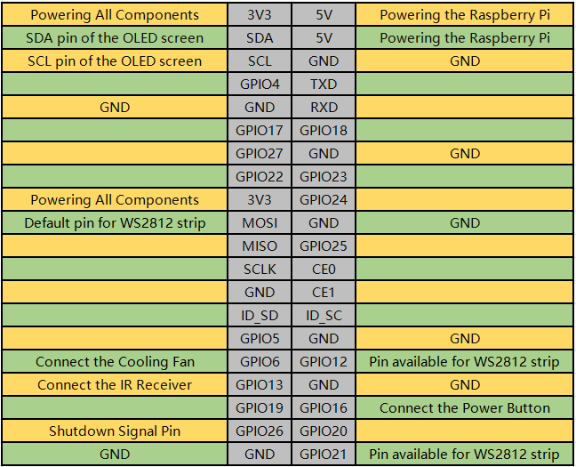
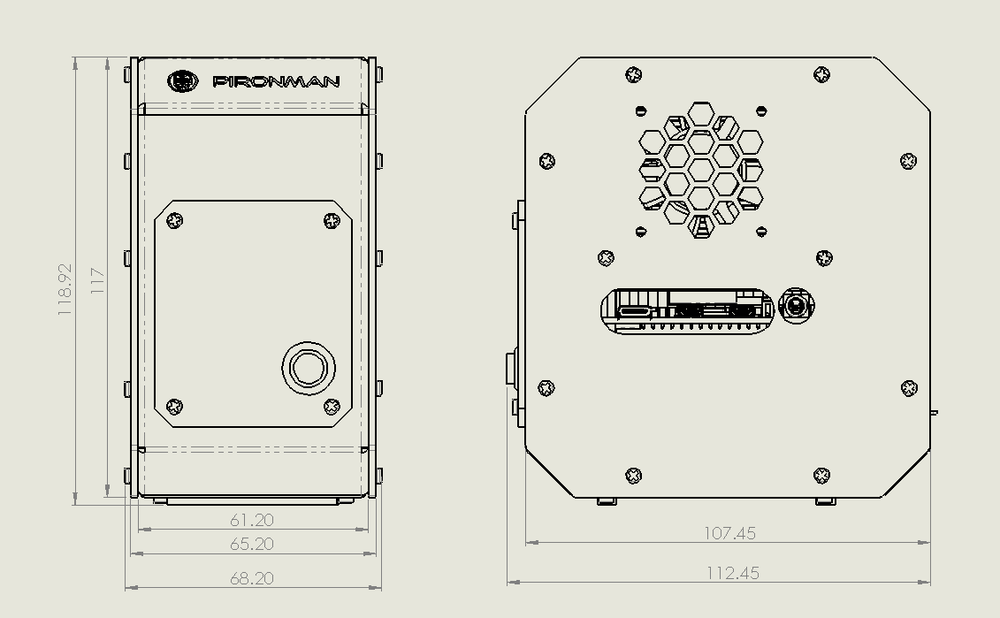

Features
======================

**Functions**

* Raspberry Pi mini PC
* Tower cooler can cool a 100% CPU load Pi to 39°C at 25°C room temperature
* Onboard USB to M.2 SATA SSD, TRIM supported
* IR Receiver for multi-media center like Kodi or Volumio
* RGB Fan, with GPIO control
* 16 WS2812 Addressable RGB LED light up the whole case with cool light effect
* Retro metal power button with indicator light for safe shut down
* 0.96" OLED Display showing Raspberry Pi's CPU usage, temperature, disk usage, IP address, RAM usage etc.
* External GPIO extender with pin name label, for easy access
* Power status memory, remembers the power status incase accident power cut off
* Re-wiring the microSD card for easy access
* Aluminum main body with clear Acrylic side panel

**Parameters**

1. Dimension: 112.45x68.2x118.92mm
2. Material
    a. Main body: aluminum alloy
    b. Both sides and front panel: acrylic
3. Support platform: Raspberry Pi 4B
4. Power input: USB Type C 5V/3A
5. Rated power: 5V/800mA
6. interface (d ~ i is the original Raspberry Pi interface exposed)
    a. Raspberry Pi standard 40-Pin GPIO
    b. micro SD
    c. USB Type C power input
    d. USB 2.0 x 2
    e. USB 3.0
    f. Gigabit LAN port
    g. USB Type C Raspberry Pi power supply (direct power to Raspberry Pi, not recommended)
    h. micro HDMI x 2
    i. 3.5mm headphone jack
7. Power button
8. OLED screen: 0.96'' 128x64 resolution
9. Infrared receiver: 38KHz
10. Cooling fan: size 40x40x10mm
11. WS2812 RGB LED: 16xWS2812B-5050

**Pin Functions**

* **Shutdown Signal Pin**: By pressing the power button, the Raspberry Pi will power off, while setting GPIO26 to a high level, and if the Main Board detects this high level, it will power cut.

**Dimensional Drawing**

