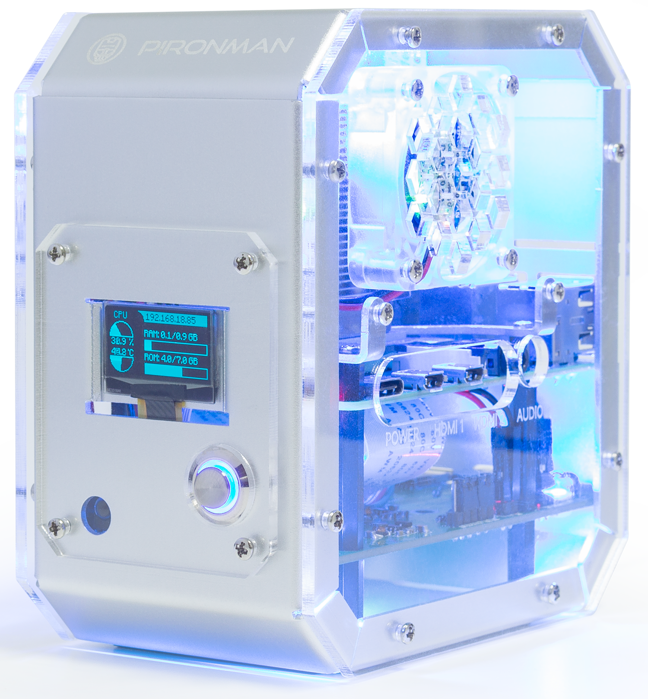

Pironman V2.0- SunFounder Mini PC Kit for Raspberry Pi
=================================================================

Thanks for choosing our Pironman V2.0.

.. note::
    This document is available in the following languages.

        * |link_german_tutorials|
        * |link_jp_tutorials|
        * |link_en_tutorials|
    
    Please click on the respective links to access the document in your preferred language.

.. note::

    We offer two versions of Pironman. It's crucial to note that the scripts in each version's online tutorial are not interchangeable. 
    
    To ensure the proper setup, you'll need to identify your version using the short link provided in your instruction sheet:

    * If the link is "pironman-v2.rtfd.io", continue with this tutorial.
    * If the link displays "pironman.rtfd.io", kindly follow the tutorial at |link_pironman_v1|.

    .. image:: img/about_version.jpg
        :width: 500
        :align: center

Pironman is SunFounder's customized Mini PC for Raspberry Pi. Just connect the screen, mouse and keyboard, and you can use it for projects, entertainment and office.

* Small size of 4.43'' x 2.69'' x 4.68''
* Raspberry Pi mini PC
* Tower cooler can cool a 100% CPU load Pi to 39°C at 25°C room temperature
* 0.96" OLED Display showing Raspberry Pi's CPU usage, temperature, disk usage, IP address, RAM usage etc
* Onboard USB to M.2 SATA SSD, TRIM supported
* RGB Fan, with GPIO control
* 16 WS2812 Addressable RGB LEDs
* IR Receiver for multi-media center like Kodi or Volumio
* External GPIO extender with pin name label
* Power status memory, remembers the power status, automatically boot after accident power cut off
* Aluminum main body with clear Acrylic side panel

.. note::
    Please find links below to configurations for the WS2812 RGB Strip and M.2 SATA SSD.

    * :ref:`rgb_strip`
    * :ref:`ssd`

.. note::

    Pironman compatible systems are shown below. If you have other systems installed, some of the Pironman components may not be available.

    .. image:: img/compitable_system_hm.png

If you have any questions, please send an email to service@sunfounder.com and we will respond as soon as possible.

**About the display language**

This document is available in other languages as well. To switch the display language, kindly click on the **Read the Docs** icon located in the lower left corner of the page.

.. image:: img/translation.png
       :align: center

.. raw:: html

    

.. toctree::
    :maxdepth: 2

    About this Kit <self>
    what_do_we_need    
    list_and_assembly
    install_the_os
    set_up_your_raspberry_pi
    setup_pironman
    about_hardware
    appendix/appendix
    home_assistant    
    faq

Copyright Notice

All contents including but not limited to texts, images, and code in this manual are owned by the SunFounder Company. You should only use it for personal study,investigation, enjoyment, or other non-commercial or nonprofit purposes, under therelated regulations and copyrights laws, without infringing the legal rights of the author and relevant right holders. For any individual or organization that uses these for commercial profit without permission, the Company reserves the right to take legal action.

