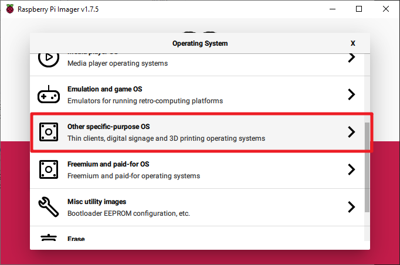
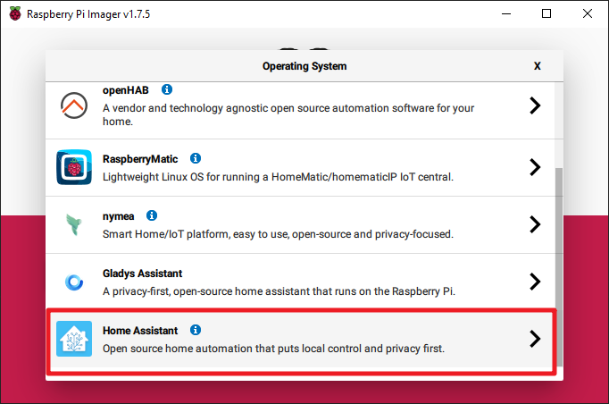
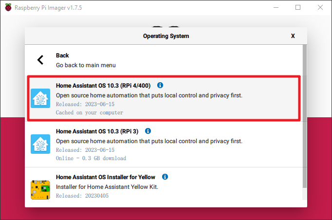
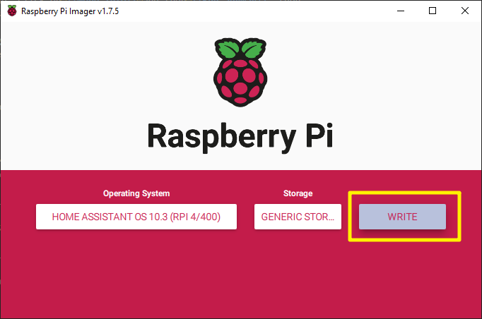
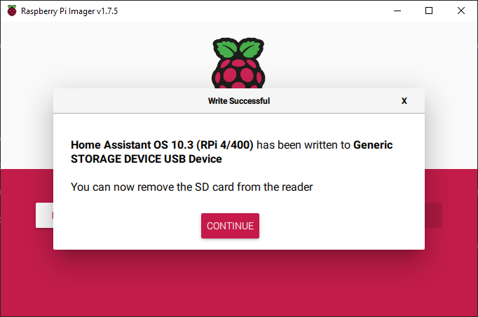

.. _install_hassos:

HassOS installieren
============================

**Schritt 1**

Die Raspberry Pi Foundation bietet ein grafisches SD-Karten-Schreibtool an, das unter Mac OS, Ubuntu 18.04 und Windows funktioniert. Dies ist für die meisten Nutzer die einfachste Möglichkeit, da das Tool das Image automatisch herunterlädt und auf die SD-Karte schreibt.

Besuchen Sie die Download-Seite: https://www.raspberrypi.org/software/. Klicken Sie auf den Link für den **Raspberry Pi Imager**, der zu Ihrem Betriebssystem passt. Sobald der Download abgeschlossen ist, starten Sie das Installationsprogramm.

.. image:: img/image11.png
    :align: center

**Schritt 2**

Beim Start des Installationsprogramms könnte Ihr Betriebssystem versuchen, die Ausführung zu blockieren. Unter Windows könnte beispielsweise folgende Meldung erscheinen:

Klicken Sie in diesem Fall auf **More info** und dann auf **Run anyway**. Befolgen Sie dann die Anweisungen zur Installation des Raspberry Pi Imagers.

.. image:: img/image12.png
    :align: center

**Schritt 3**

Stecken Sie Ihre SD-Karte in den SD-Kartensteckplatz Ihres Computers oder Laptops.

**Schritt 4**

Im Raspberry Pi Imager wählen Sie das Betriebssystem aus, das Sie installieren möchten, und die SD-Karte, auf der es installiert werden soll.

.. image:: img/sp230627_181052.png

**Schritt 5**

Wählen Sie die zu verwendende SD-Karte aus.

.. image:: img/image14.png
    :align: center

**Schritt 6**

Klicken Sie auf den Button **WRITE**.

**Schritt 7**

Falls sich aktuell Dateien auf Ihrer SD-Karte befinden, sollten Sie diese vorab sichern, um einen dauerhaften Datenverlust zu vermeiden. Falls keine Dateien gesichert werden müssen, klicken Sie auf **Yes**.

.. image:: img/image18.png
    :align: center

**Schritt 8**

Nach einer gewissen Wartezeit erscheint ein Fenster, das den Abschluss des Schreibvorgangs anzeigt.

