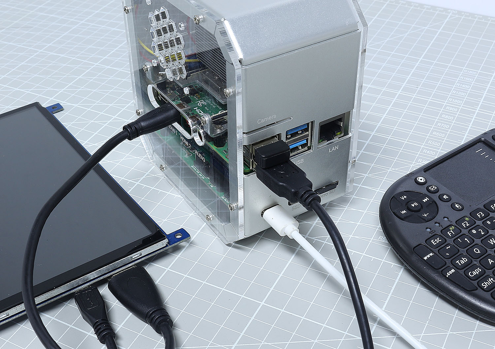
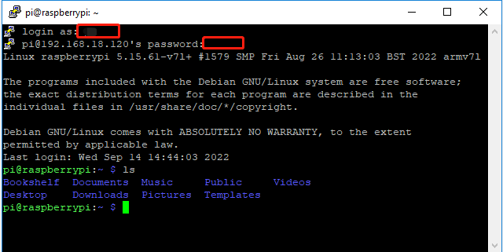

4. Login to Raspberry Pi
============================

If You Have a Screen
-------------------------

If you have a screen, it will be easy for you to operate on the Pironman.

1. Insert the TF card (Micro SD card) you’ve set up with Raspberry Pi OS into the micro SD card slot on the Pironman.
#. Plug in the Mouse and Keyboard.
#. Connect the screen to Raspberry Pi’s HDMI port.
#. Power the Pironman with a 5V/3A Type C cable and press the power button on the Pironman to turn it on.
#. After a few seconds, the Raspberry Pi OS desktop will be displayed.
#. Now you can open the terminal by clicking the icon in the upper left corner.

    .. note::
        Don't forget to press the power button on the Pironman to turn it on.

    .. image:: img/login1.png

If You Have No Screen
--------------------------

If you don’t have a display, you can log in to the Raspberry Pi remotely. However, you need to get the IP address of the Raspberry Pi first and then use an application to log in to the Raspberry Pi as SSH.

.. note::
    * In order to login remotely to Raspberry Pi you must enable SSH, set up a username and password, and configure the correct Wi-Fi when installing Raspberry Pi OS. Please refer to **Step 6** of::ref:`install_os` for a detailed tutorial.
    * Don't forget to press the power button on the Pironman to turn it on.

.. image:: img/connect_power.jpg

1. Get the IP Address
^^^^^^^^^^^^^^^^^^^^^^^^^

After the Raspberry Pi is connected to WIFI, we need to get the IP
address of it. There are many ways to know the IP address, and two of
them are listed as follows.

**Checking via the router**

If you have permission to log in the router(such as a home network), you
can check the addresses assigned to Raspberry Pi on the admin interface
of router.

The default hostname of the Raspberry Pi OS is **raspberrypi**, and you
need to find it. (If you are using **ArchLinuxARM** system, please find
**alarmpi**.)

**Network Segment Scanning**

You can also use network scanning to look up the IP address of Raspberry
Pi. You can apply the software, **Advanced IP scanner** and so on.

Scan the IP range set, and the name of all connected devices will be
displayed. Similarly, the default hostname of the Raspberry Pi OS is
**raspberrypi**, if you haven't modified it.

2. Use the SSH Remote Control
^^^^^^^^^^^^^^^^^^^^^^^^^^^^^^^^^

We can open the Bash Shell of Raspberry Pi by applying SSH. Bash is the
standard default shell of Linux. The Shell itself is a program written
in C that is the bridge linking the customers and Unix/Linux. Moreover,
it can help to complete most of the work needed.

**For Linux or/Mac OS X Users**

**Step 1**

Go to **Applications**->\ **Utilities**, find the **Terminal**, and open
it.

.. image:: img/image21.png
    :align: center

**Step 2**

Type in **ssh pi@ip_address** . ``pi`` is your username and ``ip_address`` is
your IP address. For example:

.. code-block::

    ssh pi@192.168.18.197

**Step 3**

Input **yes**.

.. image:: img/image22.png
    :align: center

**Step 4**

Input the passcode and the password.

.. image:: img/image23.png
    :align: center

**Step 5**

We now get the Raspberry Pi connected and are ready to go to the next
step.

.. image:: img/image24.png
    :align: center

.. note::
    When you input the password, the characters do not display on
    window accordingly, which is normal. What you need is to input the
    correct password.

**For Windows Users**

If you're a Windows user, you can use SSH with the application of some
software. Here, we recommend **PuTTY**.

**Step 1**

Download `PUTTY <https://www.chiark.greenend.org.uk/~sgtatham/putty/latest.html>`_.

**Step 2**

Open PuTTY and click **Session** on the left tree-alike structure. Enter
the IP address of the RPi in the text box under **Host Name (or IP
address)** and **22** under **Port** (by default it is 22).

.. image:: img/image25.png
    :align: center

**Step 3**

Click **Open**. Note that when you first log in to the Raspberry Pi with
the IP address, there prompts a security reminder. Just click **Yes**.

**Step 4**

When the PuTTY window prompts **login as**, type in
``pi`` (the user name of the RPi), and password.

.. note::

    When you input the password, the characters do not display on window accordingly, which is normal. What you need is to input the correct password.
    
    If inactive appears next to PuTTY, it means that the connection has been broken and needs to be reconnected.
    

**Step 5**

Here, we get the Raspberry Pi connected and it is time to conduct the next steps.

.. note::

    If you are not satisfied with using the command window to control the Raspberry Pi, you can also use the remote desktop function, which can help us manage the files in the Raspberry Pi easily.

    For details on how to do this, please refer to :ref:`remote_desktop`.
