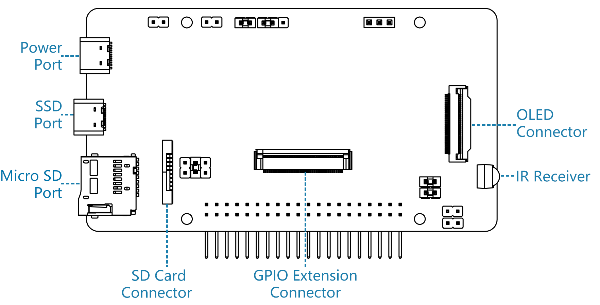
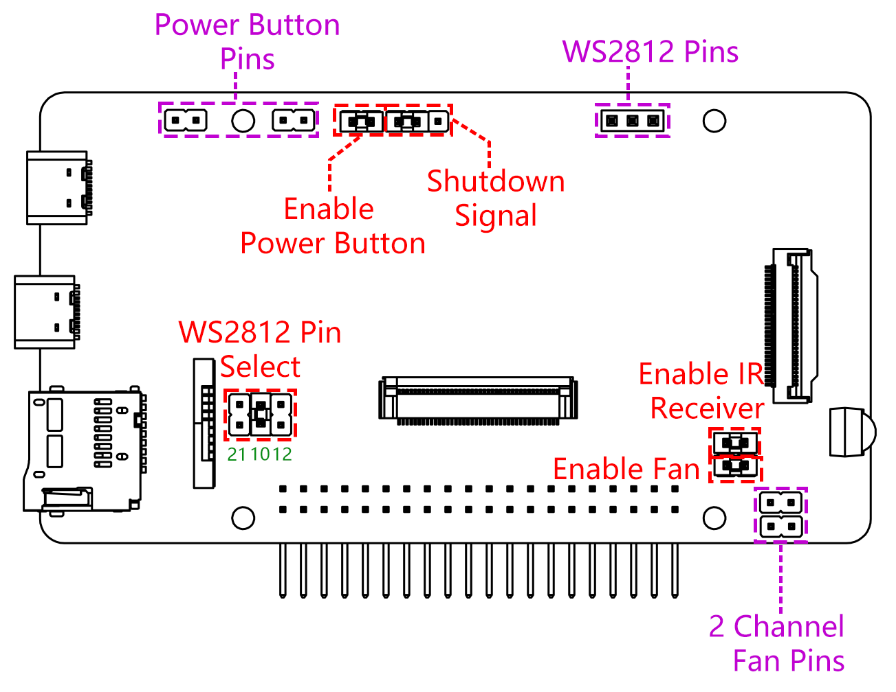

メインボード
================

**ポートについて**

**ピンについて**

.. note::
   ファンピンの2チャンネルが提供されており、Pironmanの前後に同時にファンを組み立てることができます。

メインボードには5つのジャンパーキャップがあり、各ジャンパーキャップは一つの機能に対応しています。機能が不要で、ピンを別の場所で使用したい場合は、ジャンパーキャップを抜くことができます。以下は、5つのジャンパーキャップの機能に関する詳しい説明です。

* **電源ボタンの有効化**: このジャンパーキャップを引き抜くと、電源ボタンは動作しません。また、電源ボタンはスリープモードでのOLEDスクリーンの起動にも使用されます。

* **シャットダウン信号 (IO26)**: メインボードは ``State`` ピンのレベルに応じて電源をオン/オフします。 ``State`` が低いときに電源がオンになり、 ``State`` が高いときに電源がオフになります。

    * ジャンパーキャップでGNDとstateを接続すると、電源ボタンを10秒間押し続けることでメインボードをオフにすることができます。
    * ``State`` とIO26をジャンパーキャップで接続すると、設定後、Raspberry PiはIO26を通じて ``State`` ピンを制御できます。Raspberry Piがオンのときは ``State`` が低レベルに設定され、Raspberry Piがオフのときは ``State`` が高レベルに設定されるため、マザーボードとRaspberry Piは同期して電源をオン/オフできます。

* **WS2812ピン選択**: Raspberry PiにはWS2812 RGB LEDストリップを駆動するための3つの高速信号駆動モードがあります。しかし、これらのモードには他の用途があり、WS2812 RGB LEDストリップに使用すると、元々の機能が無効になります。

        * PCM (IO21) はデジタルオーディオ（HDMIオーディオ）のためのものです。
        * SPI (IO10) はSPIインターフェースのためのものです。
        * PWM (IO12) はアナログオーディオ（3.5mmオーディオジャック）のためのものです。

    デフォルトではSPI (IO10) 駆動モードが選択されています。組み立て過程で異なるピン（例えばIO21）に切り替える場合は、対応する設定も変更する必要があります。

        .. code-block:: shell

            pironman -rp 21

* **ファンの有効化**: このジャンパーキャップを抜くと、ファンは常に回転します。ファンが不要な場合は、ファンのワイヤを抜くか、ファンを取り外すことができます。
* **IRレシーバーの有効化**: このジャンパーキャップを抜くと、IRレシーバーは動作しません。

**電源遮断メモリ**

Pironmanが突然電源を失った場合、メインボードのチップはこの状態を記録し、次回は自動的に電源をオンにします。
