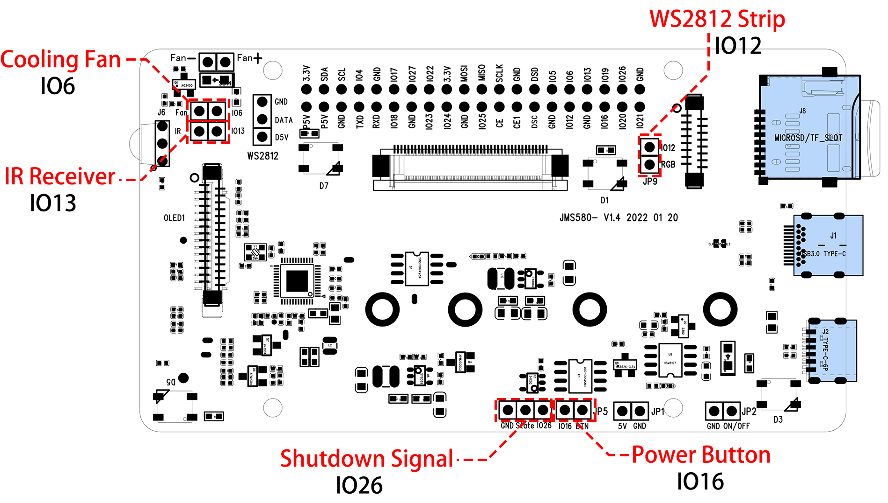

Main Board
================

**About the Jumper Caps**

There are 5 jumper caps on the Main Board, each jumper cap corresponds to a function, if you do not need the function and want to use the pin elsewhere, you can unplug the jumper cap. The following is a detailed explanation of the functions of the five jumper caps.

* **Cooling Fan (IO6)**: The fan is always spinning when this jumper cap is unplugged. You can unplug the fan wires or remove the fan if you don't need it.
* **IR Receiver (IO13)**: If you pull out this jumper cap, the IR Receiver will not work.
* **WS2812 Strip (IO12)**: If you pull out this jumper cap, the WS2812 Strip will not work.
* **Shutdown Signal (IO26)**: The Main board powers on/off depending on the level of the ``State`` pin; when ``State`` is low, it powers on, and when ``State`` is high, it powers off.

    * You can only turn off the main board by pressing and holding the power button for 10 seconds if you connect GND and state with a jumper cap. 
    * If you connect ``State`` and IO26 with a jumper cap, after configuration, the Raspberry Pi can control the ``State`` pin through IO26. When Raspberry Pi is on, ``State`` will be set to low level, when Raspberry Pi is off, ``State`` will be set to high level, so the motherboard and Raspberry Pi can power on/off synchronously.

* **Power Button (IO16)**: If you pull out this jumper cap, the power button will not work. Besides, the power button is also used to wake up the OLED screen in Sleep Mode.

**Power Cut Memory**

When the Pironman suddenly loses power, the chip of the Main Board will record this state and will automatically power on the next time.