.. _set_up_homeass:

Setup Your Home Assistant
==================================

**Step1**

This step is about enabling the I2C interface to start the Pironman OLED.

Open File Explorer and access the SD card named ``Hassio-boot``

Create a new folder named ``CONFIG`` in the root partition.

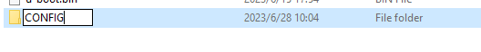

Inside the ``CONFIG`` folder, create a folder named ``modules``.

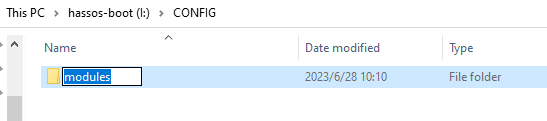

Enable file extension display.

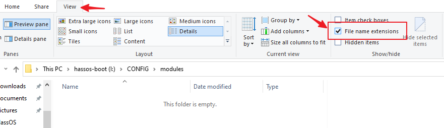

Create a text file inside the ``modules`` folder and rename it to ``rpi-i2c.conf`` . You will be prompted to confirm the extension change, select "Yes".

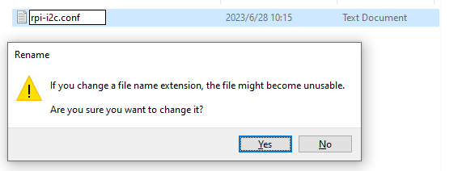

Open ``rpi-i2c.conf`` with Notepad and add the following content:

.. code-block::

    i2c-dev

Save and close the file.

**Step2**

This step involves configuring the RGB LED.

Open the file named ``config.txt`` in the ``Hassio-boot`` directory.

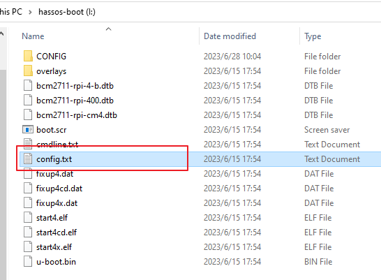

Add the following content at the bottom:

.. code-block::

    dtparam=i2c_vc=on
    dtparam=i2c_arm=on
    dtoverlay=gpio-poweroff,gpio_pin=26,active_low=0
    dtoverlay=gpio-ir,gpio_pin=13

Now you need to verify the pin used to drive the RGB LED on your Pironman.

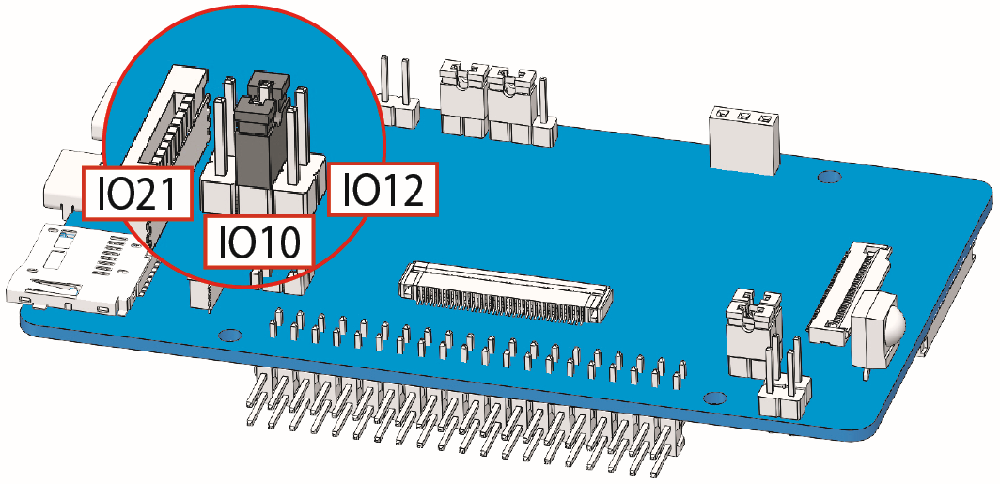

.. note:: If your Pironman does not require a jumper for this pin, it is likely connected to GPIO12 by default.

* For PWM (GPIO12), it uses audio to drive the LED, so disable the audio. Add the following at the bottom of the ``config.txt`` file:

    .. code-block::

        dtparam=audio=off

* For SPI (GPIO10), it uses SPI to drive the LED, so enable SPI and set the core frequency to 500. Add the following at the bottom of the ``config.txt`` file:

    .. code-block::

        dtparam=spi=on
        core_freq=500
        core_freq_min=500
        # Enable audio if you need it.
        dtparam=audio=on

* For PCM (GPIO21), it uses PCM to drive the LED, and no additional configuration is needed. However, it may interfere with I2S devices such as ``hifiberry-dac`` or ``i2s-mmap`` , so make sure to disable them. Enable audio if you need it.

    .. code-block::

        # Enable audio if you need it.
        dtparam=audio=on
        # Comment out the i2s device.
        # dtoverlay=hifiberry-dac
        # dtoverlay=i2s-mmap

Save and close the file.

**Step3**

Next, we will configure WiFi for Pironman.

.. note:: If you intend to use a wired connection for network access, you can skip this step.

Create a folder named ``network`` inside the ``CONFIG`` folder.

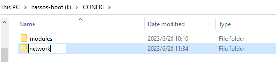

Inside the ``network`` folder, create a new text file named ``my-network`` (without extension).

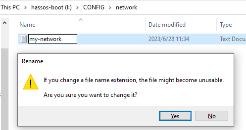

In the ``my-network`` file, write the following text, replacing ``MY_SSID`` and ``MY_WLAN_SECRET_KEY`` with your own network's SSID and password:

.. code-block::

    [connection]
    id=my-network
    uuid=72111c67-4a5d-4d5c-925e-f8ee26efb3c3
    type=802-11-wireless

    [802-11-wireless]
    mode=infrastructure
    ssid=MY_SSID
    # Uncomment below if your SSID is not broadcasted
    #hidden=true

    [802-11-wireless-security]
    auth-alg=open
    key-mgmt=wpa-psk
    psk=MY_WLAN_SECRET_KEY

    [ipv4]
    method=auto

    [ipv6]
    addr-gen-mode=stable-privacy
    method=auto

Save and exit the file.

**Step4**

Remove the microSD card from your computer and insert it into the Raspberry Pi. Then, connect the power (and Ethernet cable if needed).

Go back to your computer and navigate to ``homeassistant.local:8123`` , 
or if that doesn't work, you can find the IP address by checking your router.

During the first use of Home Assistant, you may need to wait for some time as it performs initial setup.

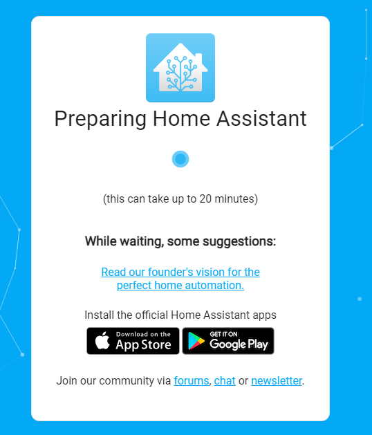

**Step5**

Next, you will be prompted to create the first account.

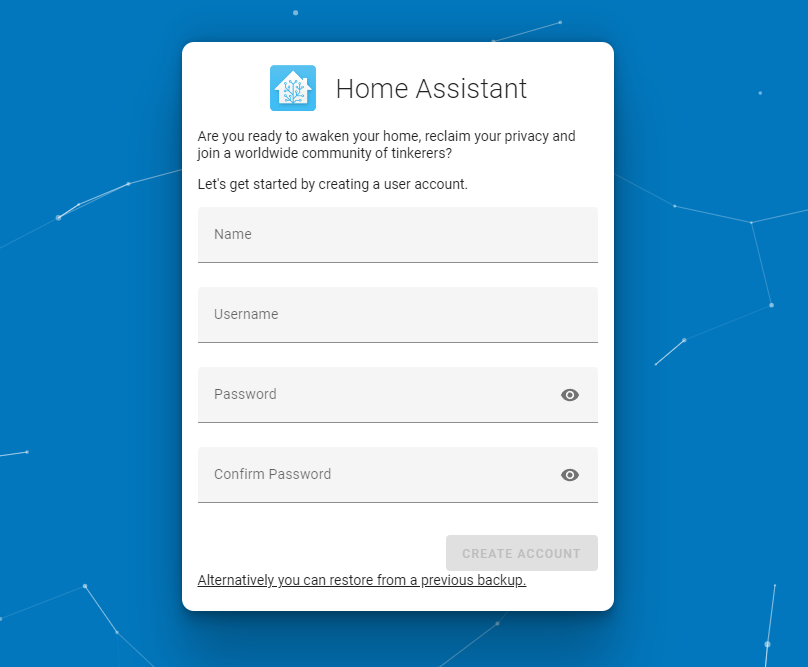

The system will prompt you to install some detected devices, but for now, you can skip this by clicking FINISH.

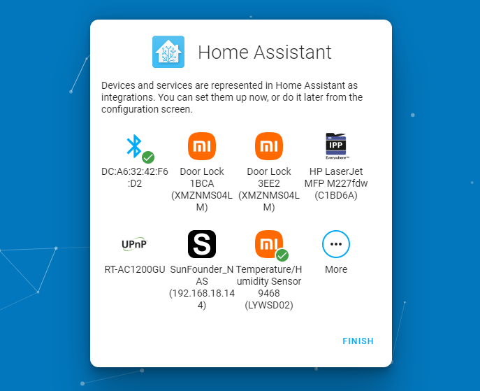

**Step6**

Now we will install the Pironman addon for Home Assistant.

Please click the button below to quickly add it. Then proceed to **step7** .

.. raw:: html

    

Alternatively, follow the steps below to install manually:

1. In Home Assistant, navigate to Settings -> Addons.

    .. image:: img/sp230628_150312.png

2. Click the "Addon Store" button in the lower right corner.

    .. image:: img/sp230628_150338.png

2. Click the menu button in the top right corner and select "Repositories".

    .. image:: img/sp230627_145728.png

3. Type the repository URL: ``https://github.com/sunfounder/home-assistant-addon`` , and click Add. After adding the SunFounder repository, close the popup window.

    .. image:: img/sp230627_150423.png

4. Click the menu button again, and click "Check for updates".

    .. image:: img/sp230627_150716.png

5. After a few seconds, the Pironman addon will appear at the end of the addon store. If not, try refreshing the page.

    .. image:: img/sp230627_150717.png

**Step7**

Enter the Pironman addon and click Install. This process may take a few minutes.

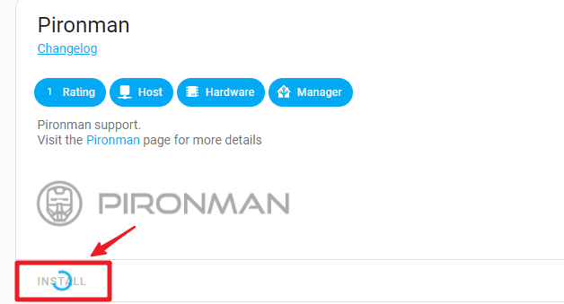

Currently, you need to disable protection mode to allow the addon to access hardware information. Find "Protection Mode" and turn it off. Then, start (or restart) the addon.

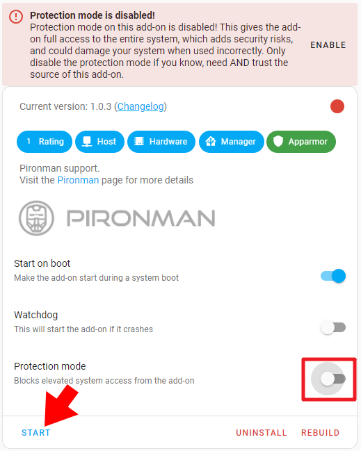

At this point, you should see the Pironman's lighting effect and the OLED display light up. This indicates that the configuration is complete.

Troubleshooting
-------------------------

If your OLED or RGB strip fails to start properly, please go to the "Log" page.

.. image:: img/sp230628_162143.png

.. code-block::

    [DEBUG] oled init failed:
    [Errno 2] No such file or directory
    Cannot open /dev/spidev0.0. spi_bcm2835 module not loaded?

.. code-block::

    [DEBUG] rgb_strip init failed:
    ws2811_init failed with code -13 (Unable to initialize SPI)

If you see the above logs, it means the configuration was not successful. Please follow the steps below:

1. First, shut down Home Assistant.

    .. warning::

        If you force power off, it may damage HassOS. Follow the shutdown steps below:

        .. image:: img/sp230628_162821.png

        .. image:: img/sp230628_162906.png

        Then, wait for one minute before unplugging the power.

2. Repeat **Step 1** and **Step 2** of this section (:ref:`set_up_homeass`) .

3. Insert the SD card back into Pironman, connect the power, and wait for a minute or two. Then, in your browser, navigate to ``http://homeassistant.local:8123/`` . Click on START in the Pironman Addon.

    .. raw:: html

        

4. Wait for a moment, and you should see the Pironman (RGB strip & OLED) light up.

Addon Configuration
-----------------------------

You can customize the Pironman effects on the Configuration page.

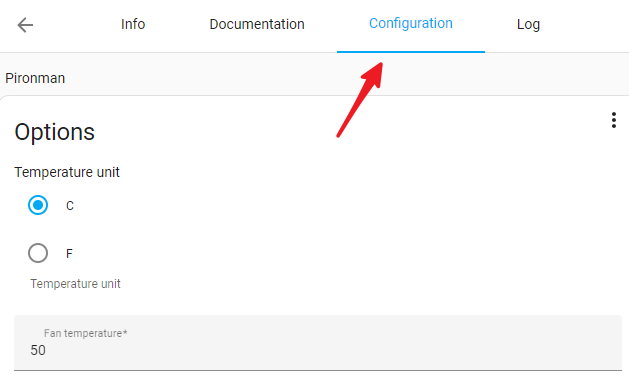

Here, you can modify:

* The temperature display unit on the OLED.
* The duration of the OLED screen brightness.
* The temperature at which the fan will start working.
* The color and blinking mode of the RGB strip.

After making the desired changes, click "SAVE" to apply the settings.