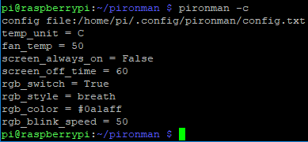
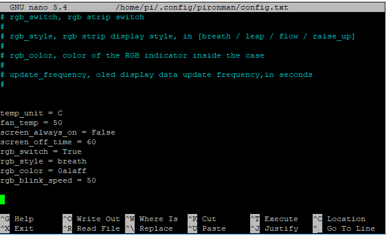

5. Set up the Pironman
===================================

.. note::
    * This Pironman is used in the same way as PC and requires the power button to power on/off.
    * The Pironman is currently only available for Raspberry Pi OS.

.. _change_config:

Change the ``config.txt``
-----------------------------------
Before you can start using Pironman, you need to configure the power button and the IR receiver.

Open the ``/boot/config.txt`` file with the following command.

.. code-block::

    sudo nano /boot/config.txt

Add the following text to the end of the file, noting that there should be no spaces on either side of the ``=``.

.. code-block::

    dtoverlay=gpio-poweroff,gpio_pin=26,active_low=0
    dtoverlay=gpio-ir,gpio_pin=13

Press ``Ctrl+X`` -> ``Y`` -> ``Enter`` to save and exit editing.

Then you will need to reboot Raspberry Pi to take effect.

.. code-block::

    sudo reboot

Install ``pironman`` module
----------------------------

Use the following commands to download and install the ``pironman`` module.

.. code-block::

    cd ~
    git clone https://github.com/sunfounder/pironman.git
    cd ~/pironman
    sudo python3 install.py

After installation, the program will start automatically. Here are the basic configurations for Pironman.

   * The OLED screen will display the CPU, RAM and ROM Usage, CPU Temperature and IP Address of the Raspberry Pi.
   * After 60 seconds, the OLED display goes into sleep mode, and you can wake it up by a short press on the power button.
   * The fan is turned on at 50 degrees Celsius.
   * Turn on the WS2812 RGB strip so that it displays in color #0a1aff(blue) and in breath mode (change rate is 50%).
   * At this point, you can press and hold for 2 seconds to safely shut down or 10 seconds to forcibly shut down.

.. note::
    
    If you are using Raspberry Pi OS Lite, you will need to install ``git`` and ``python3`` first, which you can do with the following commands.

    .. code-block::
    
        sudo apt update
        sudo apt install git python3-pip python3-setuptools python3-smbus 

Modify the Configuration
-----------------------------

In the ``pironman`` module, we have some basic configurations for Pironman, and you can check them with the following command.

.. code-block::

    pironman -c

The current configurations are shown below.

   * The fan is turned on at 50 degrees Celsius.
   * The duration of the OLED display is 60s, after 60s it will start to sleep.
   * Turn on the WS2812 RGB strip so that it displays in color #0a1aff and in breath mode (change rate is 50%).

You can also modify these configurations to suit your needs.

Use ``pironman`` or ``pironman -h`` or ``pironman --help`` to view the instructions, as follows.

.. code-block::

    Usage:
    pironman <OPTION> <input>

    Options:
    start            start pironman service
    stop             stop pironman service
    restart          restart pironman service
    -h,--help        help, show this help
    -c,--check       show all configurations
    -a,--auto        [ on ],enable auto-start at boot
                    [ off ], disable auto-start at boot
    -u,--unit        [ C/F ], set the unit of temperature,
                        C or F (Celsius/Fahrenheit)
    -f,--fan         [ temp ], Temperature at which the fan switches on,
                    in celsius (default 50),in range (30 ~ 80)
    -al,--always_on  [on/off], whether the screen is always on,
                    default False
    -s,--staty_time  [time], screen display duration in second,
                    in second, default 30
    -rw,--rgb_sw     [on/off], rgb strip switch
    -rs,--rgb_style  rgb strip display style, default: breath,
                    in [breath / leap / flow / raise_up]
    -rc,--rgb_color  [(HEX)color], set the color of rgb strip,
                    default: 0a1aff
    -rb,--rgb_speed  [speed], rgb blink speed (0 ~ 100, default 50)

For example, to turn off the automatic execution of programs at boot.

.. code-block::

    pironman -a off

Or reset the color of WS2812 RGB strip.

.. code-block::

    pironman -rc ff8a40

Those configurations are stored in ``/.config/pironman/config.txt``, and you can also make changes directly in this file.

.. code-block::

    sudo nano ~/.config/pironman/config.txt

Press ``Ctrl+X`` -> ``Y`` -> ``Enter`` to save and exit editing.

.. note::
    For details on the introduction and configuration of the components in Pironman, please refer to: :ref:`about_hardware`.