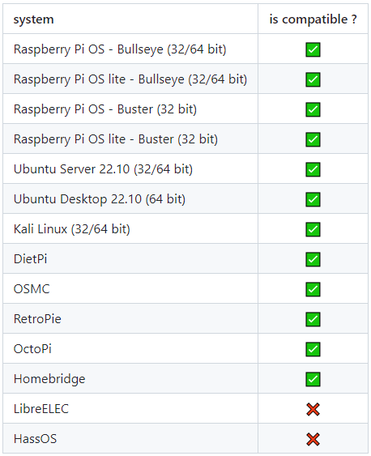
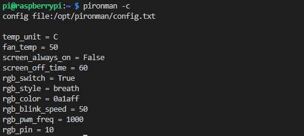
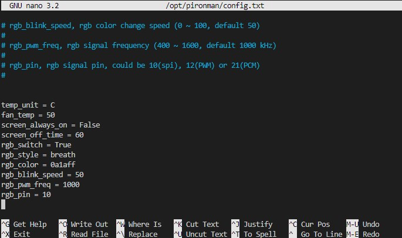

5. Set up the Pironman
===================================

.. note::
    * This Pironman is used in the same way as PC and requires the power button to power on/off.

.. _change_config:

Compatible Systems
-----------------------------------

Pironman compatible systems are shown below.

If your systems that don't have ``git``, ``python3`` and ``pip`` pre-installed you need to install them first.

.. code-block:: shell

    sudo apt-get update
    sudo apt-get install git -y
    sudo apt-get install python3 python3-pip python3-setuptools -y

Install ``pironman`` module
----------------------------

Use the following commands to download and install the ``pironman`` module.

.. code-block:: shell

    cd ~
    git clone https://github.com/sunfounder/pironman.git -b v2.0
    cd ~/pironman
    sudo python3 install.py

.. warning::  The ``-b v2.0`` in the directive is necessary

Rebooting is required after installation to take effect. A reboot reminder will pop up at some point, and you can select ``y`` to reboot now or at a later time.

Here are the basic configurations for Pironman.

   * The OLED screen will display the CPU, RAM and ROM Usage, CPU Temperature and IP Address of the Raspberry Pi.
   * After 60 seconds, the OLED display goes into sleep mode, and you can wake it up by a short press on the power button.
   * The fan is turned on at 50 degrees Celsius.
   * Turn on the WS2812 RGB strip(default connection in IO10) so that it displays in color #0a1aff(blue) and in breath mode (change rate is 50%).
   * At this point, you can press and hold for 2 seconds to safely shut down or 10 seconds to forcibly shut down.

Modify the Configuration
-----------------------------

In the ``pironman`` module, we have some basic configurations for Pironman, and you can check them with the following command.

.. code-block:: shell

    pironman -c

The current configurations are shown below.

   * The fan is turned on at 50 degrees Celsius.
   * The duration of the OLED display is 60s, after 60s it will start to sleep.
   * Turn on the WS2812 RGB strip(default 10) so that it displays in color #0a1aff and in breath mode (change rate is 50%).

You can also modify these configurations to suit your needs.

Use ``pironman`` or ``pironman -h`` or ``pironman --help`` to view the instructions, as follows.

.. code-block:: shell

    Usage:
        pironman <OPTION> <input>

    Options:
        start            start pironman service

        stop             stop pironman service

        restart          restart pironman service

        -h,--help        help, show this help

        -c,--check       show all configurations

        -a,--auto        [ on ],enable auto-start at boot
                         [ off ], disable auto-start at boot

        -u,--unit        [ C/F ], set the unit of temperature,
                             C or F (Celsius/Fahrenheit)

        -f,--fan         [ temp ], Temperature at which the fan switches on,
                         in celsius (default 50),in range (30 ~ 80)

        -al,--always_on  [on/off], whether the screen is always on,
                         default False

        -s,--staty_time  [time], screen display duration in second,
                         in second, default 30

        -rw,--rgb_sw     [on/off], rgb strip switch

        -rs,--rgb_style  rgb strip display style, default: breath,
                         in [breath / leap / flow / raise_up / colorful]

        -rc,--rgb_color  [(HEX)color], set the color of rgb strip,
                         default: 0a1aff

        -rb,--rgb_speed  [speed], rgb blink speed (0 ~ 100, default 50)

        -pwm,--rgb_pwm   [frequency], rgb signal frequency (400 ~ 1600, default 1000 kHz)

        -rp,--rgb_pin    [pin], rgb signal pin, could be [10 / spi/ SPI / 12 / pwm/ PWM] or
                         [21 / pcm / PCM], default 10

For example, to turn off the automatic execution of programs at boot.

.. code-block:: shell

    pironman -a off

Or reset the color of WS2812 RGB strip.

.. code-block:: shell

    pironman -rc ff8a40

Those configurations are stored in ``/opt/pironman/config.txt``, and you can also make changes directly in this file.

.. code-block:: shell

    sudo nano /opt/pironman/config.txt

Press ``Ctrl+X`` -> ``Y`` -> ``Enter`` to save and exit editing.

.. note::
    The introduction and configuration of the Pironman components can be found in: :ref:`about_hardware`.