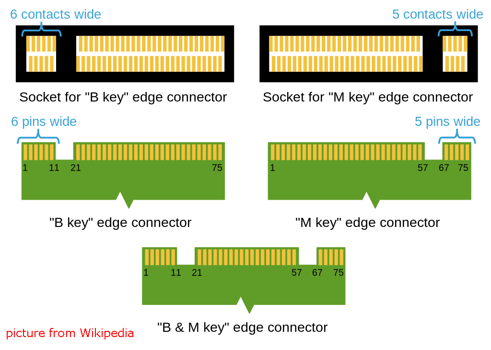
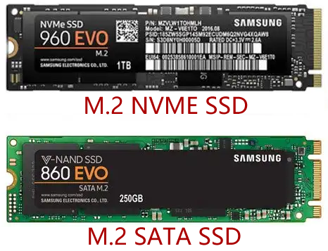
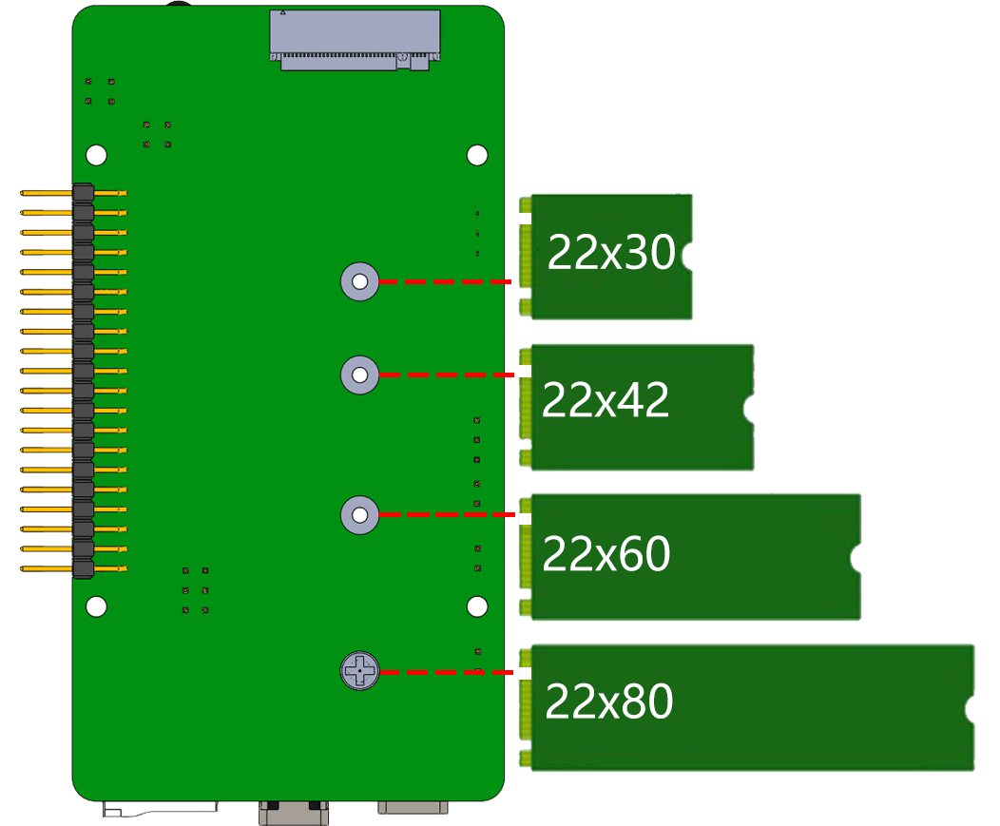

.. _ssd:

SATA M.2 SSD
=====================================

Why not compitable with NVME M.2 SSD?
--------------------------------------

.. note::
    The M.2 SSD hard drive interface only supports SATA protocol, not NVME/PCIe.

Our current interface is designed to support SATA M.2 SSDs, and we want to clarify our decision to not offer compatibility with NVMe M.2 SSDs:

The primary factor is that while NVMe SSDs excel in high-performance computing environments, the Raspberry Pi 4's processing capacity and bus bandwidth are limited. This means that even if an NVMe SSD is connected, hardware constraints could prevent it from fully utilizing the SSD's performance advantages, resulting in suboptimal resource utilization.

Furthermore, the USB power supply on the Raspberry Pi 4 has limitations. Connecting an NVMe SSD might lead to insufficient power supply, especially under heavy workloads. NVMe SSDs often require higher currents for stable performance, but the Raspberry Pi 4's USB ports might not meet these power demands, leading to unstable SSD operation or even failure to function properly.

Due to these reasons, connecting an NVMe SSD wouldn't yield significant performance improvements. This is why we have chosen not to support the NVMe SSD interface.

We appreciate your understanding of our design considerations. Our commitment is to provide you with a product that effectively meets your needs while delivering a seamless experience.

About the Model
---------------------------

M.2 SSD (M.2 solid-state drive) comes in various models, depending on their specifications and performance characteristics. Here are some common M.2 SSD models:

* **SATA M.2 SSD**: This is the most common type of M.2 SSD, using the SATA interface. They typically offer lower read/write speeds and lower prices, suitable for general computing tasks.
* **NVMe M.2 SSD**: This is a higher-performance type of M.2 SSD, utilizing the NVMe (Non-Volatile Memory Express) interface. NVMe SSDs provide faster transfer speeds and lower latency, suitable for tasks that require high-speed data transfer, such as gaming and large file processing.
* **PCIe M.2 SSD**: This type of M.2 SSD uses the PCI Express (PCIe) interface, offering higher bandwidth and faster speeds. They are typically more expensive than SATA and NVMe SSDs and are suitable for professional users who require the highest performance, such as video editing and scientific computing.

M.2 SSDs come in three key types: B key, M key, and B+M key. However, later on, the B+M key was introduced, combining the functionalities of the B key and M key. As a result, it replaced the standalone B key. Please refer to the image below.

In general, M.2 SATA SSDs are B+M-keyed (can fit in sockets for B-keyed and M-keyed modules), while M.2 NVMe SSDs for PCIe 3.0 x4 lane are M-keyed.

About the Length
-----------------------

M.2 modules come in different sizes and can also be utilized for Wi-Fi, WWAN, Bluetooth, GPS, and NFC.

Pironman supports four M.2 SATA SSD sizes based on their names: 2230, 2242, 2260, and 2280. The "22" is the width in millimeters (mm), and the two following numbers are the length. The longer the drive, the more NAND flash chips can be mounted; therefore, the more capacity.

Assemble the SSD
------------------------------

#. Take off the base plate of the Pironman.

    .. image:: img/ssd1.jpg
        :width: 600

#.  Remove the screw for the M.2 SATA SSD.

    .. image:: img/ssd2.jpg

#. Insert your M.2 SATA SSD.

    .. image:: img/ssd3.jpg

#. Screwed in place.

    .. image:: img/ssd4.jpg

#. Put the base plate back on.

    .. image:: img/ssd5.jpg

#. Plug in SSD Bridge and 5V/3V power supply.

    .. image:: img/ssd18.jpg
        
**Booting from SSD**
---------------------------
Now that you've installed the SSD on your Raspberry Pi, let's explore how to install the Raspberry Pi OS on it and configure the Raspberry Pi to boot from the SSD.

**1. Install Raspberry Pi OS to SSD**

There are two methods to install Raspberry Pi OS on your SSD:

* The first method is to directly install it via the **Raspberry Pi Imager**. This method is similar to installing the OS on a Micro SD card. Just select your SSD when you're prompted to choose a storage device. If you're unfamiliar with this process, you can refer to the tutorial :ref:`install_os`.

* The alternative method is copying from your existing SD card. If you want to retain the files and system on your SD card, this method is for you.

Let's walk through how you can copy the contents of your Micro SD to the SSD:

#. Insert the micro SD card into the Pironman, plug in the USB Bridge to connect the SSD to the Raspberry Pi, and power the pironman up.

    .. image:: img/ssd18.jpg

#. Access the Raspberry Pi desktop. You can do this by connecting a monitor directly or through remote desktop, see the tutorial for guidance: :ref:`no_screen`.

#. Launch the **SD Card Copier** from the **Accessories** section of the **start** menu.  

    .. image:: img/sd_card_copy.png

#. Choose the Copy from device (Micro SD card) and the copy to device (SSD, ``/dev/sda/``). Double-check to ensure you've selected the correct drives, then click **"Start"** to initiate the copying process. This can take around several minutes.

    .. image:: img/sd_card_copy_select.png

#. Once you see **"Copy Complete"**, shut down the Raspberry Pi and remove the micro SD card.

.. note::

    If your Micro SD card is the the **Raspberry Pi Lite**, you'll need to use commands to complete the copying process. For detailed instructions, please refer to: :ref:`copy_lite`.

**2. Install Bootloader**

With the Raspberry Pi OS now on the SSD, it's time to reset the Pi's Bootloader to prioritize booting from USB.

#. Download and install the |link_raspberry_pi_imager| from the Raspberry Pi website.

#. Insert a spare micro SD card into your computer. Please be aware that the contents of this card will be erased, so back up any important data first.

#. Launch the **Raspberry Pi Imager** and scroll down under **“Operating System”** to **“Misc Utility Images”**. Left-click to access the subsequent menu.

    .. image:: img/ssd6.png
        :width: 600
        :align: center

#. Select **Bootloader**.

    .. image:: img/ssd7.png
        :width: 600
        :align: center

#. Next, choose **USB Boot**. This will bring us back to the main menu.

    .. image:: img/ssd8.png
        :width: 600
        :align: center

#. Under **"Storage"**, select the micro SD card. Double-check to ensure you've chosen the correct drive before proceeding. 

    .. image:: img/ssd88.png
        :width: 600
        :align: center

#. Click **“WRITE”** to download the configuration image and write it to the micro SD card.

    .. image:: img/ssd9.png
        :width: 600
        :align: center

#. Wait for a successful write confirmation before removing the micro SD card from your computer.

#. Insert the micro SD card into the Pironman and power it up.

    .. image:: img/connect_power.jpg

#. Once the update is complete, the green activity LED will flash steadily. If you have an HDMI monitor connected, the screen will turn green upon completion. The update might take 10 seconds or even longer, so ensure you don't remove the micro SD card during this process.

    .. image:: img/ssd10.jpg

#. Turn off the Raspberry Pi's power and remove the micro SD card.

**3. Boot from SSD**

#. At this point, ensure the micro SD card is removed. Connect the USB Bridge to connect the SSD to the Raspberry Pi. Now, power up the Pironman.

    .. image:: img/login1.png
        :align: center

